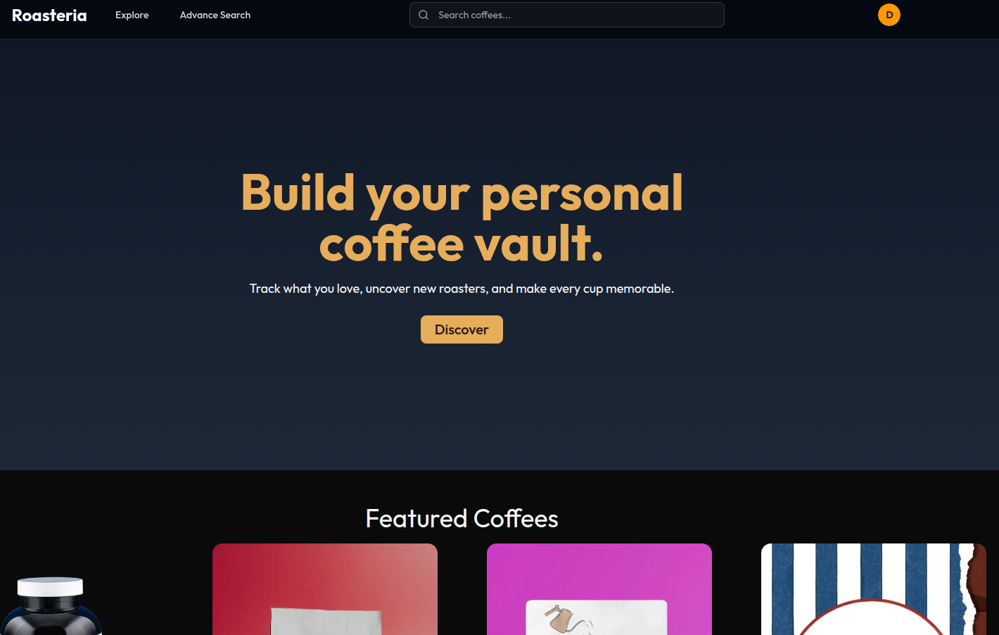
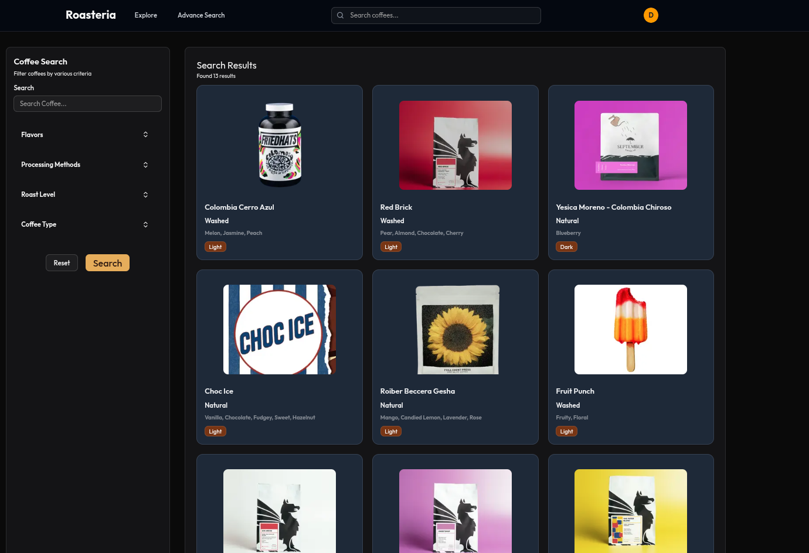

# ☕ Roasteria

A full-stack coffee discovery and tracking platform where users can explore specialty coffees, write reviews, and share their coffee journey with the community.

**Live Demo:** [roasteria.netlify.app](https://roasteria.netlify.app)

---

## 🎯 Project Overview

Built as a learning project to demonstrate React/Next.js skills after 3 years of Angular development. Features include user authentication, search/filtering, reviews, and public user profiles.

---

## ✨ Key Features

- **Coffee Discovery** – Browse and search 100+ specialty coffees with advanced filtering
- **User Profiles** – Public profiles showcasing coffee collections and reviews
- **Review System** – Rate coffees and share tasting notes
- **Personal Tracking** – Save coffees to "Tried" and "Want to Try" lists
- **Roaster Pages** – Dedicated pages for coffee roasters with their full catalog
- **Responsive Design** – Fully optimized for mobile, tablet, and desktop

---

## 🛠️ Tech Stack

**Frontend:**

- shadcn/ui components
- Zustand (state management)

**Backend:**

- Supabase Auth (user authentication)
- Row Level Security (RLS) for data protection

**Deployment:**

- Netlify (frontend)
- Supabase (backend/database)

---

## 📸 Screenshots

### 🏠 Main Page

  

### 🔍 Search

  

